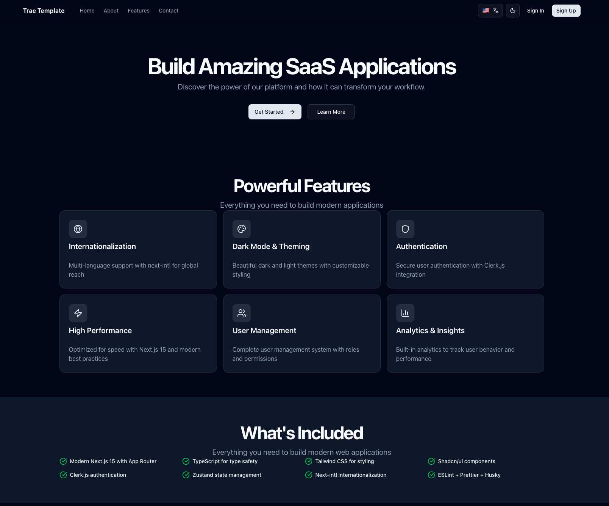

# 🚀 Next.js + Strapi Monorepo Template

> **Production-ready monorepo template** with Next.js 15, Strapi 5, Clerk authentication, and full-stack TypeScript.



<div align="center">

[](https://nextjs.org/)
[](https://react.dev/)
[](https://www.typescriptlang.org/)
[](https://strapi.io/)
[](https://clerk.com/)
[](https://pnpm.io/)

</div>

## 🎯 What is This?

A **complete monorepo starter** that combines the best of modern web development: blazing-fast Next.js frontend, flexible Strapi CMS backend, secure Clerk authentication, and seamless data synchronization. Perfect for SaaS applications, content-driven sites, and enterprise projects.

## ✨ Features

### 🏗️ **Monorepo Architecture**

- **Frontend** (`apps/frontend`) - Next.js 15 with App Router and React 19
- **Backend** (`apps/backend`) - Strapi 5 headless CMS with PostgreSQL/SQLite
- **Shared** (`apps/shared`) - Common documentation and assets
- **Unified tooling** - ESLint, Prettier, TypeScript configs shared across workspaces

### 🔐 **Authentication & Security**

- **Clerk.js** - Complete auth solution (sign-up, sign-in, user management)
- **Automatic sync** - Clerk webhooks sync user data to Strapi
- **Protected routes** - Middleware-based authentication guards
- **Session management** - Secure JWT tokens with server-side validation
- **Security headers** - CSP, HSTS, X-Frame-Options configured

### 🗄️ **CMS & Database**

- **Strapi 5** - Flexible headless CMS with admin panel
- **PostgreSQL** - Production-ready with Supabase support
- **SQLite** - Fast development setup (default)
- **Type-safe API** - Auto-generated TypeScript types for CMS data
- **Custom collections** - Template user collection with Clerk integration

### 🌍 **Internationalization**

- **next-intl** - Full i18n support with SSR
- **3 languages** - English (default), Spanish, Danish
- **Locale routing** - `/en/`, `/es/`, `/da/` URL structure
- **Translation tools** - Auto-sync and verification scripts
- **Type-safe** - Autocomplete for translation keys

### 🎨 **UI & Styling**

- **Tailwind CSS v4** - Latest PostCSS-based architecture
- **shadcn/ui** - Accessible, customizable component library
- **Dark mode** - System preference + manual toggle with persistence
- **Radix UI** - Unstyled, accessible primitives
- **Responsive** - Mobile-first design approach
- **Lucide icons** - 1000+ beautiful icons

### 📱 **Progressive Web App**

- **Service Worker** - Offline support and caching
- **Web Manifest** - Install as native app
- **Network status** - Offline detection and feedback
- **Install prompt** - Custom PWA installation flow
- **Production only** - Disabled in development

### 🧪 **Testing & Quality**

- **Jest** - Unit testing with React Testing Library
- **Playwright** - E2E testing across browsers
- **ESLint** - Strict linting with TypeScript support
- **Prettier** - Code formatting with Tailwind plugin
- **Husky** - Git hooks for pre-commit validation
- **Type safety** - Strict TypeScript mode enabled
- **Coverage** - 70% threshold enforced

### 📊 **Monitoring & Analytics**

- **Sentry** - Error tracking and performance monitoring
- **Vercel Analytics** - Web vitals and user insights
- **Winston logger** - Structured logging with levels
- **Web Vitals** - CLS, FID, LCP tracking

### 🛠️ **Developer Experience**

- **Turbopack** - Next.js bundler for faster builds
- **Hot reload** - Instant feedback during development
- **VitePress** - Beautiful documentation with auto-generated sidebar
- **Storybook** - Component development and documentation
- **Node version** - Automatic NVM switching with `.nvmrc`
- **pnpm workspaces** - Fast, efficient package management

## 🚀 Quick Start

> **New to this template?** Follow our [QUICK_START.md](./QUICK_START.md) guide for a 5-minute setup!

### Prerequisites

- **Node.js**: 22.21.0 (managed via `.nvmrc`)
- **pnpm**: 10.16.1 or higher
- **Git**: Latest version

### 1. Clone & Install

```bash
# Clone the repository
git clone <your-repo-url>
cd next-js-template

# Use correct Node version (via NVM)
nvm use
# or run automatic setup
pnpm setup

# Install dependencies
pnpm install
```

### 2. Environment Configuration

Copy the environment template and configure your credentials:

```bash
cp .env.example .env.local
```

**Required environment variables:**

```env
# Clerk Authentication (REQUIRED)
NEXT_PUBLIC_CLERK_PUBLISHABLE_KEY=pk_test_your_key_here
CLERK_SECRET_KEY=sk_test_your_key_here

# Strapi CMS (REQUIRED)
NEXT_PUBLIC_STRAPI_API_URL=http://localhost:1337
STRAPI_API_TOKEN=your_strapi_token_here

# Clerk Webhook (for user sync)
CLERK_WEBHOOK_SECRET=whsec_your_webhook_secret

# App URLs
NEXT_PUBLIC_APP_URL=http://localhost:3000
```

### 3. Set Up Clerk Authentication

**⚠️ Critical Step**: The app requires Clerk to function.

1. Visit [Clerk Dashboard](https://dashboard.clerk.com)
2. Create a new application
3. Navigate to **API Keys** section
4. Copy your keys to `.env.local` (from step 2)
5. Configure allowed redirect URLs:
   - Sign-in: `http://localhost:3000/en/sign-in`
   - Sign-up: `http://localhost:3000/en/sign-up`
   - After sign-in: `http://localhost:3000/en/dashboard`

### 4. Set Up Strapi Backend (Recommended)

**Option A: Quick Start (SQLite - Development)**

```bash
# Navigate to backend
cd apps/backend

# Start Strapi in development mode
pnpm dev
```

On first run:

1. Strapi admin panel opens at `http://localhost:1337/admin`
2. Create your admin account
3. Navigate to **Settings → API Tokens → Create new API Token**
4. Name: "Frontend API", Type: "Full access"
5. Copy token to `apps/frontend/.env.local` as `STRAPI_API_TOKEN`

**Create the template-user collection:**

See detailed guide: [`docs/strapi/STRAPI_SCHEMA_SETUP.md`](./apps/shared/docs/guide/strapi/STRAPI_SCHEMA_SETUP.md)

**Option B: Production Setup (PostgreSQL)**

For Supabase or production PostgreSQL, see: [`docs/strapi/strapi-setup.md`](./apps/shared/docs/guide/strapi/strapi-setup.md)

### 5. Configure Clerk Webhook (Optional but Recommended)

Auto-sync users from Clerk to Strapi:

1. In Clerk Dashboard → **Webhooks** → **Add Endpoint**
2. URL: `http://localhost:3000/api/webhooks/clerk` (use ngrok for local)
3. Subscribe to events: `user.created`, `user.updated`, `user.deleted`
4. Copy **Signing Secret** to `.env.local` as `CLERK_WEBHOOK_SECRET`

### 6. Start Development

```bash
# Start all services (frontend + backend + docs)
pnpm dev:all

# Or start individually
pnpm dev:frontend  # Frontend only (port 3004)
pnpm dev:backend   # Strapi only (port 1337)
pnpm docs:dev      # Documentation (port 5173)
```

**Access points:**

- 🌐 Frontend: [http://localhost:3004](http://localhost:3004)
- 🗄️ Strapi Admin: [http://localhost:1337/admin](http://localhost:1337/admin)
- 📚 Documentation: [http://localhost:5173](http://localhost:5173)

### Need Help?

- 📖 **[Quick Start Guide](./QUICK_START.md)** - Get running in 5 minutes
- 🔑 **[Credentials Setup](./SETUP_CREDENTIALS.md)** - Detailed guide for API tokens and webhooks
- 📚 **[Full Setup Guide](./SETUP.md)** - Complete setup documentation

## 📁 Monorepo Structure

```text
next-js-template/
├── apps/
│   ├── frontend/               # Next.js application
│   │   ├── src/
│   │   │   ├── app/           # Next.js App Router
│   │   │   │   ├── [locale]/ # Internationalized routes
│   │   │   │   │   ├── (auth)/        # Auth pages group
│   │   │   │   │   ├── (dashboard)/   # Dashboard group
│   │   │   │   │   └── page.tsx       # Home page
│   │   │   │   ├── api/       # API routes
│   │   │   │   │   ├── webhooks/clerk/  # Clerk webhook
│   │   │   │   │   └── users/me/        # User endpoint
│   │   │   │   └── globals.css
│   │   │   ├── components/
│   │   │   │   ├── ui/        # shadcn/ui components
│   │   │   │   ├── common/    # Shared components
│   │   │   │   ├── features/  # Feature components
│   │   │   │   └── layouts/   # Layout wrappers
│   │   │   ├── hooks/         # Custom React hooks
│   │   │   ├── lib/           # Utilities & configs
│   │   │   │   ├── auth/      # Clerk configuration
│   │   │   │   ├── i18n/      # Internationalization
│   │   │   │   ├── strapi/    # Strapi client & services
│   │   │   │   └── utils/     # Helper functions
│   │   │   ├── middleware.ts  # Next.js middleware
│   │   │   ├── stores/        # Zustand state management
│   │   │   └── types/         # TypeScript definitions
│   │   ├── public/            # Static assets
│   │   └── package.json
│   │
│   ├── backend/                # Strapi CMS
│   │   ├── src/
│   │   │   ├── api/           # Custom API endpoints
│   │   │   │   └── template-user/  # User collection
│   │   │   └── index.ts
│   │   ├── config/            # Strapi configuration
│   │   │   ├── database.ts    # DB config (SQLite/PostgreSQL)
│   │   │   ├── server.ts      # Server settings
│   │   │   └── middlewares.ts
│   │   └── package.json
│   │
│   └── shared/                 # Shared resources
│       ├── docs/              # VitePress documentation
│       └── storybook-static/  # Built Storybook
│
├── scripts/                    # Utility scripts
│   ├── verify-translations.js # i18n validation
│   ├── sync-translations.js   # i18n sync
│   └── generate-docs-sidebar.js
│
├── tests/                      # Test suites
│   ├── e2e/                   # Playwright E2E tests
│   └── unit/                  # Jest unit tests
│
├── .github/
│   └── copilot-instructions.md # AI coding guidelines
│
├── eslint.config.mjs          # ESLint configuration
├── prettier.config.mjs        # Prettier configuration
├── pnpm-workspace.yaml        # pnpm workspace config
└── package.json               # Root package scripts
```

## 🛠️ Tech Stack

### Frontend

| Technology       | Version | Purpose                          |
| ---------------- | ------- | -------------------------------- |
| **Next.js**      | 15.5.4  | React framework with App Router  |
| **React**        | 19.1.0  | UI library                       |
| **TypeScript**   | 5.9.3   | Type safety                      |
| **Tailwind CSS** | 4.1.14  | Utility-first styling            |
| **Clerk**        | 6.33.3  | Authentication & user management |
| **next-intl**    | 4.3.11  | Internationalization             |
| **Zustand**      | 5.0.8   | State management                 |
| **Radix UI**     | Latest  | Accessible component primitives  |
| **Lucide React** | 0.544.0 | Icon library                     |
| **Zod**          | 4.1.12  | Schema validation                |

### Backend

| Technology     | Version | Purpose              |
| -------------- | ------- | -------------------- |
| **Strapi**     | 5.30.1  | Headless CMS         |
| **PostgreSQL** | 8.16.3  | Production database  |
| **SQLite**     | 11.7.0  | Development database |
| **Node.js**    | 22.21.0 | Runtime environment  |

### DevOps & Tooling

| Technology     | Version | Purpose               |
| -------------- | ------- | --------------------- |
| **pnpm**       | 10.16.1 | Package manager       |
| **ESLint**     | 9.37.0  | Linting               |
| **Prettier**   | 3.6.2   | Code formatting       |
| **Jest**       | 30.2.0  | Unit testing          |
| **Playwright** | 1.56.0  | E2E testing           |
| **Husky**      | 9.1.7   | Git hooks             |
| **VitePress**  | 1.6.4   | Documentation         |
| **Storybook**  | 8.6.14  | Component development |
| **Sentry**     | 10.18.0 | Error tracking        |

## 📜 Available Scripts

### Root-Level Commands

```bash
# Development
pnpm dev                 # Start all services (frontend + backend + docs)
pnpm dev:frontend        # Frontend only (port 3000)
pnpm dev:backend         # Strapi only (port 1337)

# Building
pnpm build               # Build all workspaces
pnpm build:frontend      # Build Next.js app
pnpm build:backend       # Build Strapi

# Code Quality
pnpm lint                # Run ESLint on all workspaces
pnpm lint:fix            # Auto-fix ESLint issues
pnpm format              # Format code with Prettier
pnpm format:check        # Check code formatting
pnpm type-check          # TypeScript validation

# Testing
pnpm test                # Run Jest unit tests
pnpm test:watch          # Run tests in watch mode
pnpm test:coverage       # Generate coverage report
pnpm test:e2e            # Run Playwright E2E tests
pnpm test:e2e:ui         # E2E tests with UI mode

# Documentation
pnpm docs:dev            # Start VitePress docs server (port 5173)
pnpm docs:build          # Build documentation
pnpm storybook           # Start Storybook (port 6006)
pnpm build-storybook     # Build Storybook static

# Internationalization
pnpm check:translations  # Verify i18n completeness
pnpm sync:translations   # Sync missing translation keys

# Setup
pnpm setup               # Auto-configure Node version with NVM
```

### Frontend Workspace (`apps/frontend`)

```bash
cd apps/frontend

pnpm dev                 # Start Next.js dev server
pnpm build               # Build for production
pnpm start               # Start production server
pnpm lint                # Lint frontend code
pnpm type-check          # Check TypeScript
pnpm migrate:strapi      # Run Strapi migrations
```

### Backend Workspace (`apps/backend`)

```bash
cd apps/backend

pnpm dev                 # Start Strapi in development mode
pnpm develop             # Alias for dev
pnpm build               # Build Strapi admin
pnpm start               # Start production server
pnpm strapi              # Access Strapi CLI
```

## 🌐 Internationalization

The template includes full i18n support with automatic locale detection and routing.

### Supported Languages

- 🇬🇧 **English** (`en`) - Default
- 🇪🇸 **Spanish** (`es`)
- 🇩🇰 **Danish** (`da`)

### URL Structure

```text
/en/                    → English home
/es/acerca-de           → Spanish about page
/da/dashboard           → Danish dashboard
```

### Adding New Languages

1. Create translation file:

```bash
# Create new locale file
touch apps/frontend/src/lib/i18n/locales/fr.json
```

2. Add locale to configuration:

```typescript
// apps/frontend/src/lib/i18n/config.ts
export const locales = ['en', 'es', 'da', 'fr'] as const;
```

3. Sync translations:

```bash
pnpm sync:translations
```

### Translation Management

```bash
# Verify all locales have same keys
pnpm check:translations

# Auto-sync missing keys from default locale
pnpm sync:translations
```

**Translation files location:** `apps/frontend/src/lib/i18n/locales/*.json`

## 🎨 Customization

### Theme Configuration

**Update CSS variables** (`apps/frontend/src/app/globals.css`):

```css
@theme {
  --color-primary: oklch(0.6 0.2 220);
  --color-background: oklch(1 0 0);
  /* Add custom colors */
}
```

**Modify component styles** (`apps/frontend/src/components/ui/*.tsx`):

All shadcn/ui components are fully customizable. Edit directly in the codebase.

### Authentication Customization

**Clerk appearance** (`apps/frontend/src/lib/auth/clerk-provider.tsx`):

```typescript
<ClerkProvider
  appearance={{
    variables: { colorPrimary: '#your-brand-color' },
    layout: { socialButtonsPlacement: 'bottom' },
  }}
>
```

**Auth redirects** (`.env.local`):

```env
NEXT_PUBLIC_CLERK_SIGN_IN_URL=/en/sign-in
NEXT_PUBLIC_CLERK_SIGN_UP_URL=/en/sign-up
NEXT_PUBLIC_CLERK_AFTER_SIGN_IN_URL=/en/dashboard
NEXT_PUBLIC_CLERK_AFTER_SIGN_UP_URL=/en/dashboard
```

### Strapi Customization

**Add custom collections:**

1. In Strapi admin (`http://localhost:1337/admin`)
2. Go to **Content-Type Builder**
3. Create new collection type
4. Generate TypeScript types:

```bash
cd apps/frontend
pnpm migrate:strapi  # Regenerates types from Strapi schema
```

**Database configuration** (`apps/backend/config/database.ts`):

Switch between SQLite (dev) and PostgreSQL (prod).

## 🚨 Troubleshooting

### Common Issues

#### ❌ "Clerk authentication failed"

**Solution:**

1. Verify `.env.local` has correct Clerk keys
2. Check allowed URLs in Clerk dashboard match your local/production URLs
3. Restart dev server: `pnpm dev:frontend`

#### ❌ "Strapi connection failed"

**Solution:**

1. Ensure Strapi is running: `pnpm dev:backend`
2. Verify `NEXT_PUBLIC_STRAPI_API_URL` in `.env.local`
3. Check Strapi API token is valid and has correct permissions
4. Check network: `curl http://localhost:1337/api/template-users`

#### ❌ "Module not found" errors

**Solution:**

```bash
# Clear caches and reinstall
rm -rf node_modules apps/*/node_modules
rm pnpm-lock.yaml
pnpm install
```

#### ❌ Node version errors

**Solution:**

```bash
# Use correct Node version
nvm use
# or
pnpm setup
```

Required: **Node.js 22.21.0** (for Strapi 5 compatibility)

#### ❌ Build fails with TypeScript errors

**Solution:**

```bash
# Run type checking to see errors
pnpm type-check

# Common fix: regenerate types
cd apps/frontend
pnpm migrate:strapi
```

#### ❌ Translations out of sync

**Solution:**

```bash
# Check for missing keys
pnpm check:translations

# Auto-sync all locales
pnpm sync:translations
```

### Getting Help

- 📖 Check [Documentation](http://localhost:5173) (run `pnpm docs:dev`)
- 🐛 [Open an issue](https://github.com/your-username/repo-name/issues)
- 💬 Search existing issues for solutions

## 📚 Documentation

### Available Guides

- **[Setup Guide](./SETUP.md)** - Detailed initial setup
- **[Strapi Integration](./apps/shared/docs/guide/strapi/strapi-integration.md)** - CMS setup and usage
- **[Strapi Schema Setup](./apps/shared/docs/guide/strapi/STRAPI_SCHEMA_SETUP.md)** - Collection configuration
- **[Strapi Examples](./apps/shared/docs/guide/strapi/strapi-examples.md)** - Code examples
- **[Authentication Guide](./apps/shared/docs/guide/config/authentication.md)** - Clerk configuration
- **[i18n Guide](./apps/shared/docs/guide/config/i18n.md)** - Internationalization
- **[Theming Guide](./apps/shared/docs/guide/config/theming.md)** - Customization

### API Documentation

Auto-generated API docs available at:

- **Frontend Components**: Run `pnpm storybook`
- **Strapi API**: `http://localhost:1337/admin/plugins/documentation`

### Learning Resources

- [Next.js 15 Documentation](https://nextjs.org/docs)
- [Strapi 5 Documentation](https://docs.strapi.io)
- [Clerk Documentation](https://clerk.com/docs)
- [Tailwind CSS v4](https://tailwindcss.com/docs)
- [shadcn/ui Components](https://ui.shadcn.com)
- [next-intl Guide](https://next-intl-docs.vercel.app)

## 🤝 Contributing

Contributions are welcome! Please follow these guidelines:

### Code Standards

- ✅ **English only** - All code, comments, and documentation must be in English
- ✅ **TypeScript strict mode** - No `any` types
- ✅ **ESLint clean** - 0 errors, 0 warnings (enforced)
- ✅ **Formatted** - Prettier with Tailwind plugin
- ✅ **Tested** - Unit tests for new features
- ✅ **Documented** - Update relevant docs

### Workflow

1. Fork the repository
2. Create feature branch: `git checkout -b feature/amazing-feature`
3. Make your changes
4. Run quality checks:

```bash
pnpm lint           # Must pass
pnpm format:check   # Must pass
pnpm type-check     # Must pass
pnpm test           # Must pass
```

5. Commit with [Conventional Commits](https://www.conventionalcommits.org):

```bash
git commit -m "feat(frontend): add amazing feature"
```

6. Push and create Pull Request

### Commit Message Format

```text
<type>(<scope>): <description>

Types: feat, fix, docs, refactor, test, chore, perf, style, ci, build
Scopes: frontend, backend, shared, docs, ci
```

## 📄 License

MIT License - see [LICENSE](LICENSE) file for details.

## 🙏 Acknowledgments

Built with amazing open-source projects:

- [Next.js](https://nextjs.org) by Vercel
- [Strapi](https://strapi.io) Headless CMS
- [Clerk](https://clerk.com) Authentication
- [shadcn/ui](https://ui.shadcn.com) Component Library
- [Tailwind CSS](https://tailwindcss.com) Styling Framework

---

Made with ❤️ using Next.js 15 and modern web technologies
